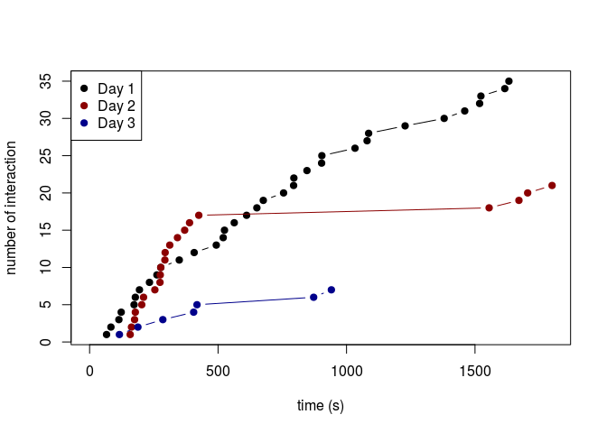
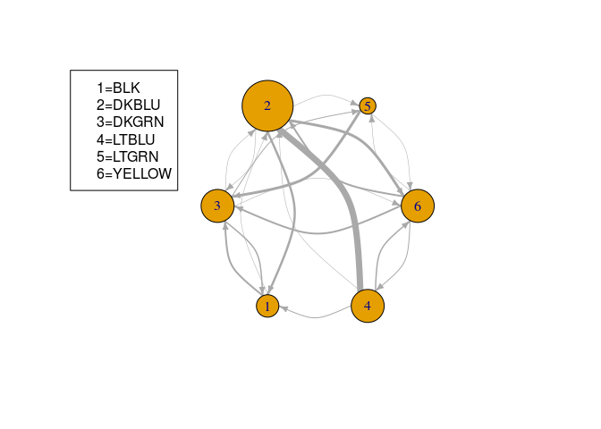

Data Analysis
================
Natalie Tarn
2/12/2019

### Motivation:

We want to test the perception of color by male ZBs, who use red
coloration in dominance signaling. If perception is the same as females,
it is fine and interesting in its own right. If different, it suggests
that selection is acting differently on males and females who assess the
same color variation. E.g., males assess dominance-related color
variation differently from how females assess mate choice-related color
variation.

## Goal 1 - test the dominance hierarchy of the males used in perception analyses

### Motivation/reasoning for Goal 1:

Although admittedly slightly unlikely, it could be that a male’s
perception of color variation is dependent upon his position in a
hierarchy.

Using the color categories we know females show (e.g., 1-5 v. 6-8), it
could be that a male of high dominance status (and, potentially, redder
coloration) would benefit from being able to assess fellow males that
are closer to his own status and, presumably, more likely to displace
him. In this way, males with coloration and dominance of a certain
category may show better perception, or a different boundary, relative
to their status/coloration.

Broadly-speaking, perception could be related to an individual’s own
phenotype. In the case of males, the phenotype is both the male’s own
coloration and his dominance status.

Importantly, this could happen even on a short-term basis, as some
experimental work has shown that beak color and dominance status can
change rapidly (i.e., within 3 days).

### Steps:

1)  load dataset
2)  look at variation in dominance interactions
3)  look at overall network of dominance interactions
4)  establish dominance rankings

### Variation in dominance interactions over time.

This plot shows how the number of interactions progresses along the
timing of filming. Note that the number of interactions decreases each
day of filming, i.e. the hierarchy likely stabilized.

    ## integer(0)

<!-- -->

### Network of dominance interactions.

This plot shows a network of who is being aggressive toward whom. Larger
circles represent indivdiuals that were involved in a greater number of
interactions. Larger arrows represent a greater number of interactions.
The legend shows which number corresponds to which individual

<!-- -->

### Dominance hierarchy

This table shows the Elo rating for each individual - a measure of how
dominant each individual is based on how often it was aggressive and how
often it received aggression.

    ##         Elo rating
    ## dkblu   296.986590
    ## yellow  114.709649
    ## ltgrn     3.196752
    ## ltblu   -31.443141
    ## dkgrn  -153.304474
    ## blk    -230.145376

## Take-home messages

It looks like individual DKBLU was overall the most dominant, and BLK
was the least dominant. We can come back to these ratings after seeing
how these individuals do in perceptual trials, and ask if there is any
correlation between dominance and perception.

Importantly, DKBLU was the only bird to have a red band during our
assessment - this is because he came from the Mooney Lab with a red band
and we didn’t remove the band before dominance assessment. I’d find it
highly unlikely that this was the sole cause of his dominance and prior
literature has found conflicting results as to whether band color
influences dominance. However, this is something to consider (and, in
future tests, we should remove red bands).
