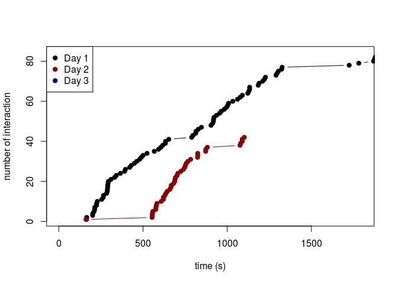
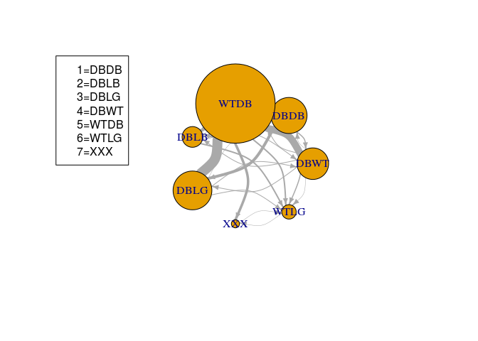
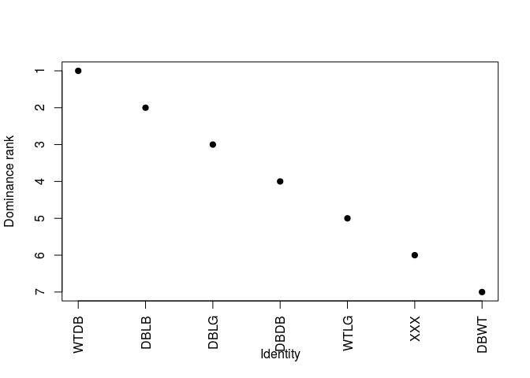
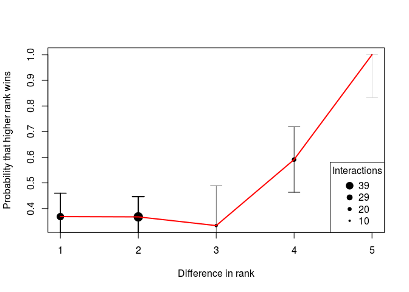

Data Analysis
================
Natalie Tarn
2/12/2019

### Motivation:

We want to test the perception of color by male ZBs, who use red
coloration in dominance signaling. If perception is the same as females,
it is fine and interesting in its own right. If different, it suggests
that selection is acting differently on males and females who assess the
same color variation. E.g., males assess dominance-related color
variation differently from how females assess mate choice-related color
variation.

## Goal 1 - test the dominance hierarchy of the males used in perception analyses

### Motivation/reasoning for Goal 1:

Although admittedly slightly unlikely, it could be that a male’s
perception of color variation is dependent upon his position in a
hierarchy.

Using the color categories we know females show (e.g., 1-5 v. 6-8), it
could be that a male of high dominance status (and, potentially, redder
coloration) would benefit from being able to assess fellow males that
are closer to his own status and, presumably, more likely to displace
him. In this way, males with coloration and dominance of a certain
category may show better perception, or a different boundary, relative
to their status/coloration.

Broadly-speaking, perception could be related to an individual’s own
phenotype. In the case of males, the phenotype is both the male’s own
coloration and his dominance status.

Importantly, this could happen even on a short-term basis, as some
experimental work has shown that beak color and dominance status can
change rapidly (i.e., within 3 days).

### Steps:

1)  load dataset
2)  look at variation in dominance interactions
3)  look at overall network of dominance interactions
4)  establish dominance rankings

### Variation in dominance interactions over time.

This plot shows how the number of interactions progresses along the
timing of filming. Note that the number of interactions decreases each
day of filming, i.e. the hierarchy likely stabilized.

    ## integer(0)

<!-- -->

### Network of dominance interactions.

This plot shows a network of who is being aggressive toward whom. Larger
circles represent indivdiuals that were involved in a greater number of
interactions. Larger arrows represent a greater number of interactions.
The legend shows which number corresponds to which
    individual

    ##   [1] DBWT DBDB DBDB DBDB DBDB DBDB DBDB DBDB DBDB DBDB DBDB DBDB WTDB DBDB
    ##  [15] DBDB DBDB DBDB DBDB DBDB DBLB DBDB DBDB DBDB DBDB DBDB DBDB DBWT DBDB
    ##  [29] WTDB DBDB DBDB DBWT DBWT WTDB WTDB WTDB WTDB DBWT DBWT WTDB DBWT WTDB
    ##  [43] WTDB WTDB WTDB WTDB WTDB WTDB WTDB DBLG WTDB WTDB WTDB WTDB WTDB WTDB
    ##  [57] WTDB WTDB WTDB WTDB WTDB WTDB WTDB WTDB WTDB WTDB WTDB WTDB WTDB WTDB
    ##  [71] WTDB WTDB WTDB WTDB WTDB WTDB WTDB DBWT WTDB DBLG DBLG DBLG DBDB DBDB
    ##  [85] XXX  WTDB WTDB WTDB WTDB WTDB WTDB WTDB WTDB WTDB WTDB WTDB WTDB WTDB
    ##  [99] WTDB WTDB WTDB WTDB WTDB WTDB WTDB WTDB WTDB WTDB WTDB WTDB WTDB WTDB
    ## [113] WTDB WTDB WTDB WTDB WTDB DBLB DBLB DBLB DBLB WTDB DBLB WTDB DBLB DBLG
    ## [127] WTLG
    ## Levels: DBDB DBLB DBLG DBWT WTDB WTLG XXX

<!-- -->

### Dominance hierarchy

This table shows the Elo rating for each individual - a measure of how
dominant each individual is based on how often it was aggressive and how
often it received aggression.

    ##       Elo rating
    ## WTDB  441.956101
    ## DBLB   54.457826
    ## DBLG   18.199433
    ## DBDB    8.725045
    ## WTLG -120.830802
    ## XXX  -187.875793
    ## DBWT -214.631810

    ## Warning in arrows(x, CIs[1, ], x, CIs[2, ], code = 3, angle = 90, length =
    ## 0.1, : zero-length arrow is of indeterminate angle and so skipped
    
    ## Warning in arrows(x, CIs[1, ], x, CIs[2, ], code = 3, angle = 90, length =
    ## 0.1, : zero-length arrow is of indeterminate angle and so skipped
    
    ## Warning in arrows(x, CIs[1, ], x, CIs[2, ], code = 3, angle = 90, length =
    ## 0.1, : zero-length arrow is of indeterminate angle and so skipped
    
    ## Warning in arrows(x, CIs[1, ], x, CIs[2, ], code = 3, angle = 90, length =
    ## 0.1, : zero-length arrow is of indeterminate angle and so skipped
    
    ## Warning in arrows(x, CIs[1, ], x, CIs[2, ], code = 3, angle = 90, length =
    ## 0.1, : zero-length arrow is of indeterminate angle and so skipped
    
    ## Warning in arrows(x, CIs[1, ], x, CIs[2, ], code = 3, angle = 90, length =
    ## 0.1, : zero-length arrow is of indeterminate angle and so skipped
    
    ## Warning in arrows(x, CIs[1, ], x, CIs[2, ], code = 3, angle = 90, length =
    ## 0.1, : zero-length arrow is of indeterminate angle and so skipped

<!-- -->

    ## Warning in simpleLoess(y, x, w, span, degree = degree, parametric =
    ## parametric, : span too small. fewer data values than degrees of freedom.

    ## Warning in simpleLoess(y, x, w, span, degree = degree, parametric =
    ## parametric, : pseudoinverse used at 0.98

    ## Warning in simpleLoess(y, x, w, span, degree = degree, parametric =
    ## parametric, : neighborhood radius 2.02

    ## Warning in simpleLoess(y, x, w, span, degree = degree, parametric =
    ## parametric, : reciprocal condition number 0

    ## Warning in simpleLoess(y, x, w, span, degree = degree, parametric =
    ## parametric, : There are other near singularities as well. 4.0804

<!-- -->

## Other options in elo scores function

identities: Optional vector containing the identity of all individuals.
This is useful if not all individuals are represented in the winners and
losers, which we may want to use for WTLG, because it is not represented
in the winners. return.as.ranks: Boolean (TRUE/FALSE) describing whether
to convert scores into ranks before returning the data.
return.trajectories: Boolean (TRUE/FALSE) describing whether to return
trajectories (the scores after each interaction T) or only the final
scores K: a parameter of the Elo function that determines the speed at
which scores change after an encounter (default K=200) The elo score
function can also be randomised (randomise=TRUE) to create K replicated
datasets (where K=n.rands) to create a 95% confidence interval and
improve estimates for ranks.

## Ardia et. al summary

### What predicts initial dominance position

Male zebra finches show consistency in aggression. Birds with greater
red chroma initiated a higher number of aggressive interactions. Hue and
body mass did not predict initial dominance position. Initial
testosterone levels were also correlated with the number of interactions
and red chroma.

### How birds respond to a single exposure of Testosterone Propionate

Dominant birds (rank 1) injected with TP stayed dominant, but
subordinate birds (rank 3) inreased their rank to rank 2 after the
injection. TP-injected birds had increased red chroma in their bills for
both dominant and subordinate birds. Hue increased in rank 3 birds.
TP-injected birds had increased testosterone levels after 3 days, where
rank 3 individuals had increased their testosterone levels more than
rank 1 individuals. Birds that had higher levels of increased T were
more aggressive, had a greater increase of red chroma, but not hue, UV
hue, or
brightness.

### Discussion - dynamic nature of bill color is mirrored by changes in testosterone levels (armament-ornament model)

In this study, we found high levels of red chroma and low levels of bill
brightness, but not hue or UV hue, were correlated with dominance and
aggression. Changes in bill color are driven partly by testosterone.
Bill color plays a role (maybe as a signal or is correlated with other
status reflecting traits) because the most aggressive and dominant birds
had higher red chroma. An increased amount of testosterone leads to
increased amounts of red chroma in bills, aggression, and changes in
dominance rank. Male-male interactions in zebra finches may be more
stable than previously thought, and there is potential for dominance
hierarchies to exist.

However, bill color does not necessarily have a direct effect on
dominance because they did not directly manipulate bill color. We
suggest to manipulate bill color directly to determine the direct role
of bill color as a social signal. There is growing evidence that
carotenoid-based signals can signal dominance.

## Male bill colour and competition in zebra finches

### Abstract

Found no difference in behavior towards an orange compared to a red
billed stimulus. However, the birds spent relatively more time eating
when alone than compared to being close to a potential competitor.
Additionally, more time was spent eating next to the orange/red billed
stimulus as compared to the green billed stimulus.

### Results and Discussion

The presence of another male reduces the proportion of time spent
eating. The red-orange difference may not be considered meaningful by
the males. They also probably ate less in front of the green-billed male
because they of its abrnormality. This study supports the notion that
beak color does not play a clear distinction in the results of the three
experiments. Bill colour may play a role in male–male interactions,
although the effect is limited and may be greater in the presence of
females.

## Bill Color Preferences of Zebra Finches

### Abstract

Females tend to prefer males who have red, bright bills while males
prefer females in the middle of the phenotypic range. Bill color appears
to be more important in heterosexual than in isosexual interactions, and
personal aesthetic preference seems to be the reason why certain mates
are favored above others.

### Results and Discussion

Males have redder and darker beaks than females and females tended to
associate with males with redder bills. When the beak of a male was
painted artificially red to achieve the SR phenotype, females preferred
that male.

## Take-home messages

It looks like individual DKBLU was overall the most dominant, ;and BLK
was the least dominant. We can come back to these ratings after seeing
how these individuals do in perceptual trials, and ask if there is any
correlation between dominance and perception.

Importantly, DKBLU was the only bird to have a red band during our
assessment - this is because he came from the Mooney Lab with a red band
and we didn’t remove the band before dominance assessment. I’d find it
highly unlikely that this was the sole cause of his dominance and prior
literature has found conflicting results as to whether band color
influences dominance. However, this is something to consider (and, in
future tests, we should remove red bands).
